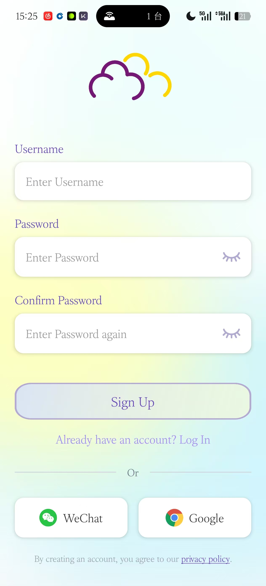
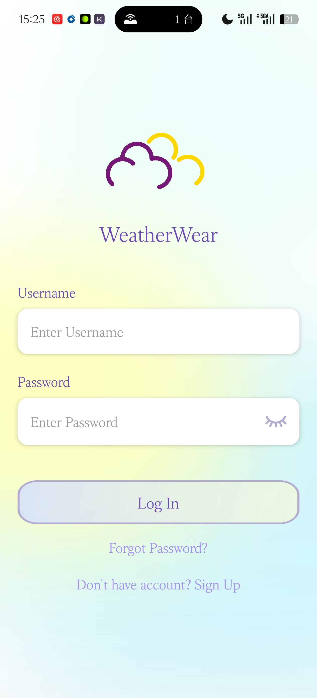
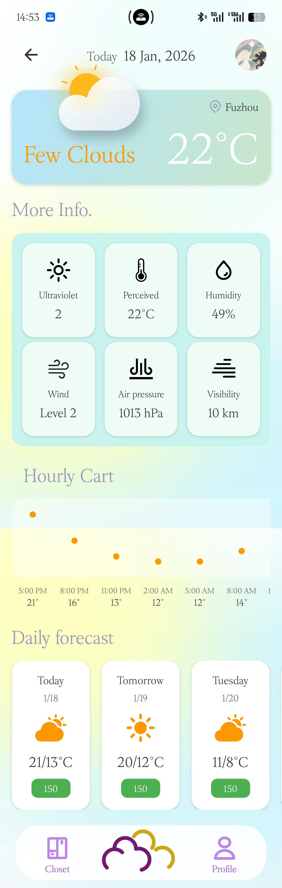
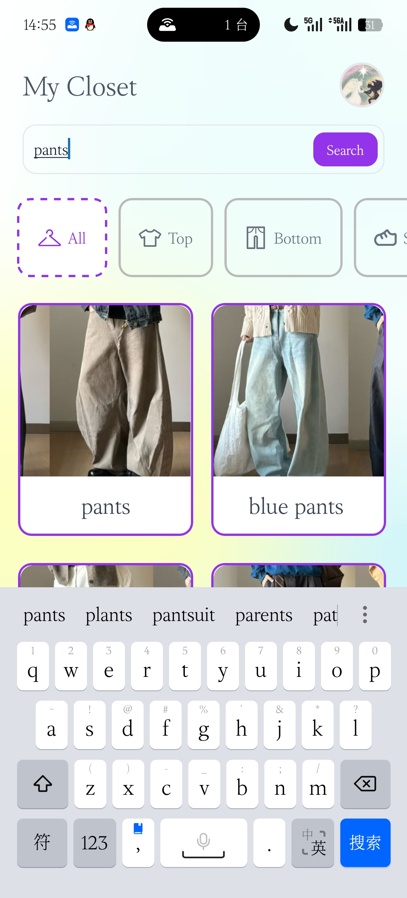
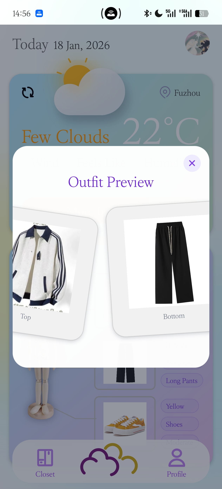
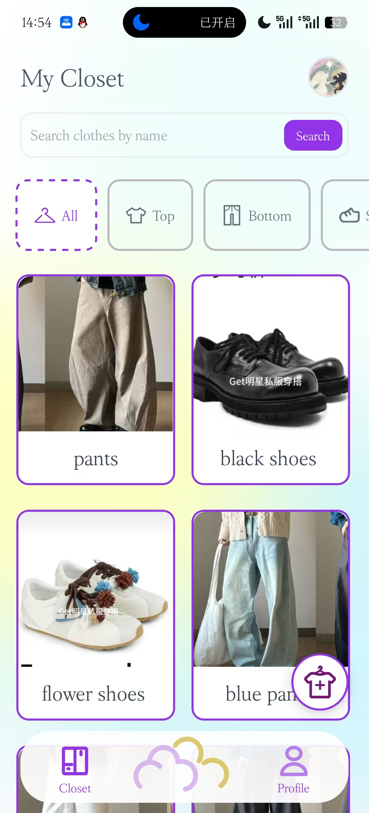
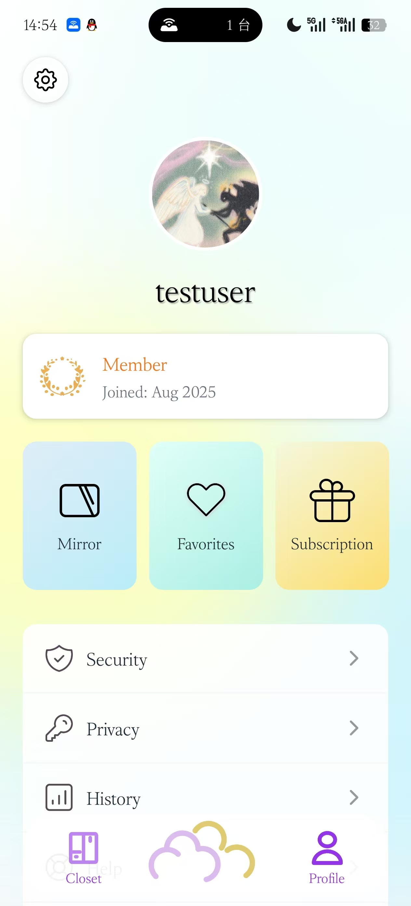
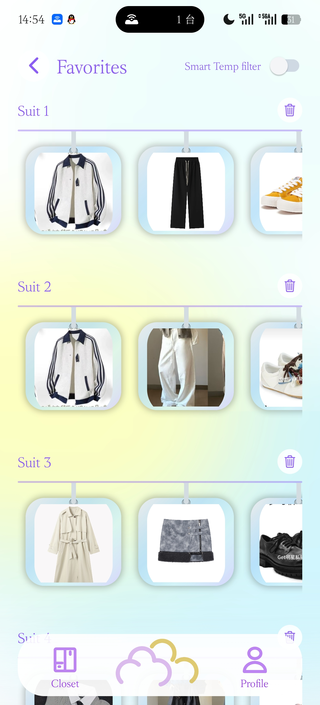

# WeatherWear

WeatherWear is a mobile application that integrates weather information, outfit recommendations, and a virtual wardrobe. Users can register and log in, manage clothing items (CRUD + image upload), view real-time weather and outfit recommendations, favorite preferred outfits, and filter favorites by temperature.

## Project Structure

```
WeatherWear/
├─ backend/              # Node.js + Express 
└─ frontend/WeatherWear/ # React Native + Expo 
```

## Funtions Overview

- User Authentication: Login/Registration, JWT authentication, Snowflake algorithm for ID generation
- User Profile: Avatar display and upload
- Virtual Wardrobe: Clothing management, categorization and search, image upload
- Weather Information: Real-time weather, detail page, hourly/daily forecasts
- Outfit Recommendations: Temperature-based outfit suggestions with "Refresh" functionality

- Favorites: Save outfits, temperature filtering

## Tech Stack

**Frontend**
- React Native + Expo
- TypeScript
- expo-router
- AsyncStorage
- expo-image-picker

**Backend**
- Node.js + Express
- Sequelize + MySQL
- JWT Authentication + SnowFlake
- Multer for file upload
- Redis caching (for weather API)

## Installation and Running

### 1) Backend

```bash
cd backend
npm install
```

Configure environment variables (e.g., database, JWT, Redis), refer to `backend/ENV_SETUP.md`.

Start the backend:

```bash
npm run dev
# 或
npm start
```

Default address: `http://localhost:5000`

### 2) Frontend

```bash
cd frontend/WeatherWear
npm install
```

Configure API address (choose one):

- Modify  `API_BASE_URL` in `frontend/WeatherWear/constants/config.ts` 
- Or set `EXPO_PUBLIC_API_BASE_URL` environment variable


Some installment:

- Using react-native-linear-gradient for gradient backgrounds `npm install react-native-linear-gradient`
- Using react-native-image-crop-picker for image selection `npm install react-native-image-crop-picker --save`

Start the frontend

```bash
npx expo start --offline
```
PS: You may use VPN to access our app (weather forecast API is abroad)
Then run using Expo Go!

## App screenshot











